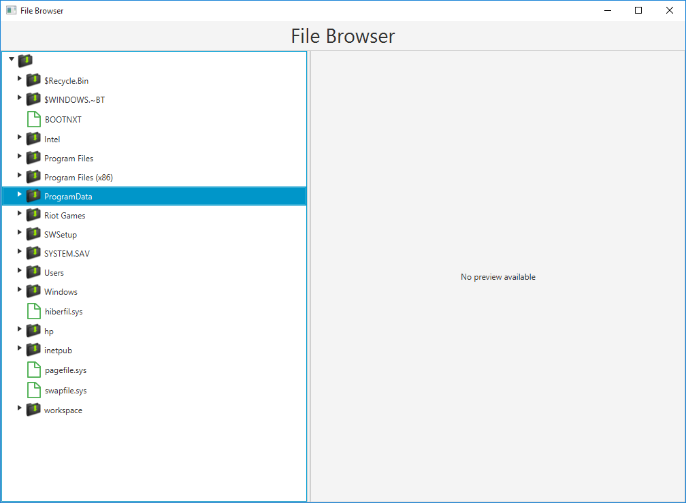
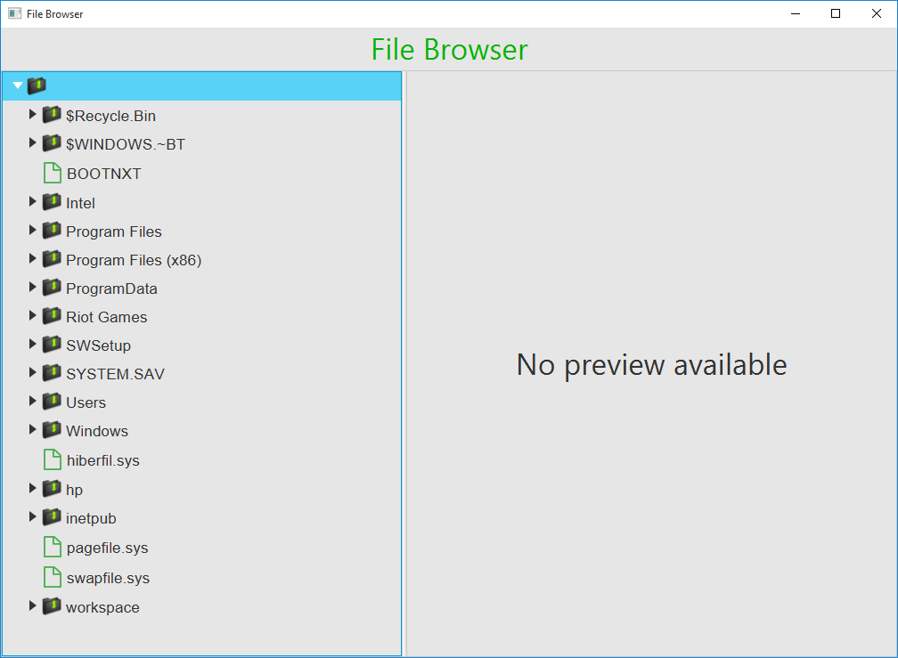
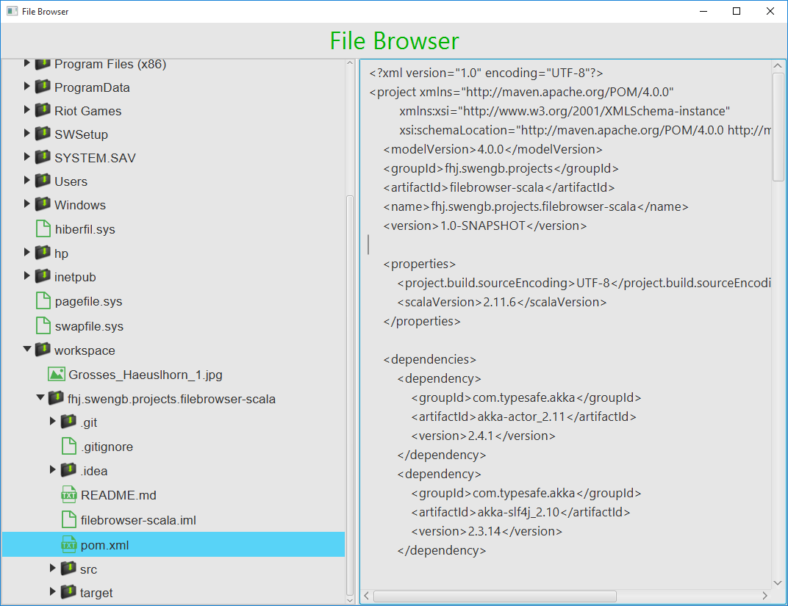
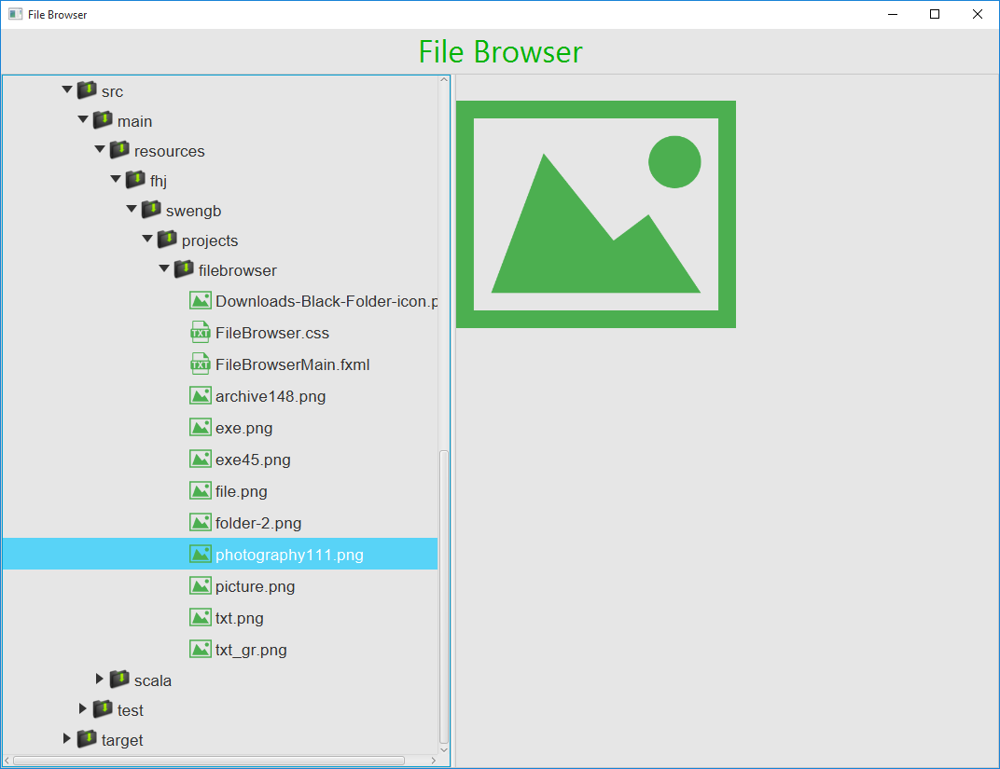
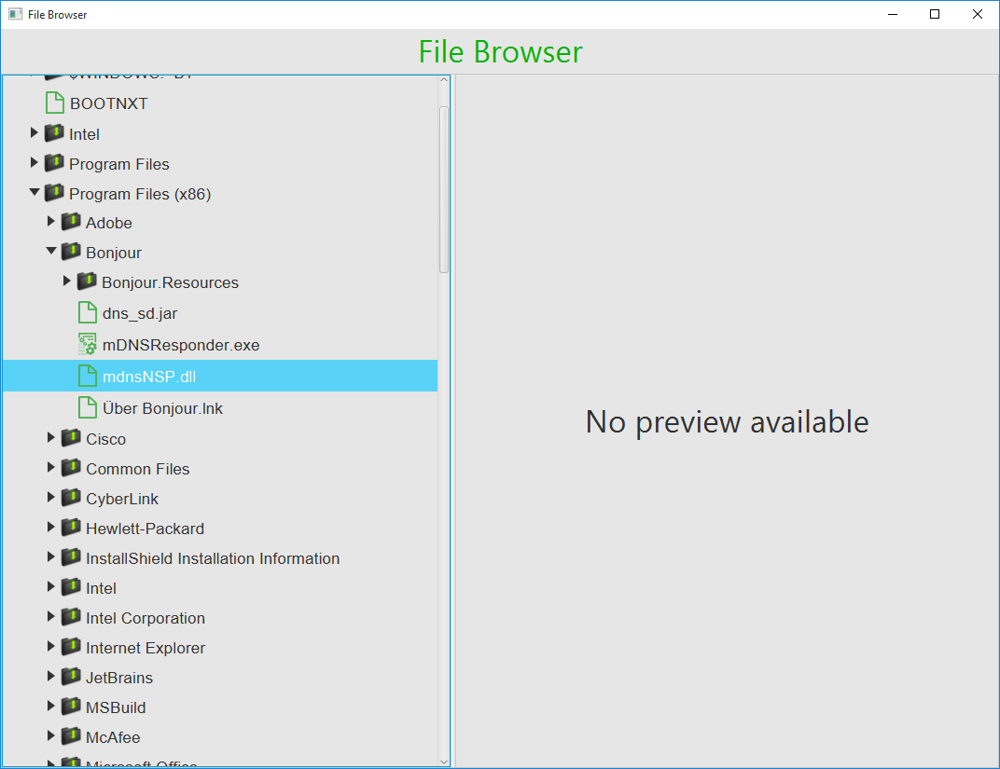

# fhj.swengb.projects.filebrowser-scala

#File Browser

This program mimics the behavior of the windows file explorer. There is a TreeView to show all folders, subfolders and files.
Additionally, there's a built- preview available, that works with common text, picture, audio and video files. Moving files and folders from one direction to the other by drag'n'drop gestures is also supported.
The visual appearance is taken care of by the usage of CSS.

### __Functions:__

* __Root with Subfolder__

* __CSS for Style__

* __Expand Tree__ 

* __Preview of files:__

    Text files (.txt , .css , .scala ,...)
    Left MouseButton on the file to open the preview

    
    Image files (.png , .jpg , .bmp ,...)
    Left MouseButton on the file to open the preview

    Audio Player(.mp3 , .wav , .aac ,...)
    Left MouseButton on the file to open the player in the preview-window

![Audio Player] (audio.png)

    Video Player(.mp3 , .wav , .aac ,...)
    Left MouseButton on the file to open the player in the preview-window

![Video Player] (video.png)

    * No Preview

* __Appropriate file icon:__

    * Text
    
    * Picture
    
    * Executable file
    
    * Other

* __Drag and Drop__
    * Move a file or folder by dragging and dropping it

    Left MouseButton on the file/folder then drag it to the desired position
    __Careful! Already existing files will be overwritten!__

* __Open with external program__

    * Double Click with left MouseButton to open the file with the assigned program
    * Note: There is a bug in certain JVM versions that causes the application to freeze

